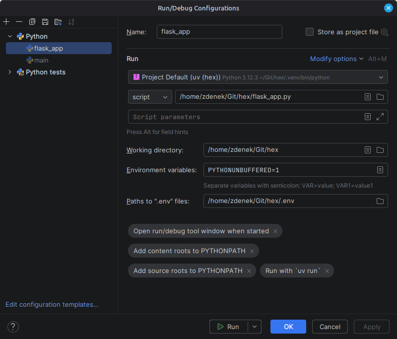

# Hex

---

# Project Description

## Structure and Tools

GitHub

* Project
* Repository
* Issues

IDE: JetBrains PyCharm

---

# To Do List

* [x] Set up project
* [x] Create repository
* [x] Hello-World
* [x] Update dependencies
* [ ] Cleanup old files
* [x] Publish
* [x] Update `flask_app.py` for PA
* [ ] Website
* [ ] Numbers
* [ ] ULI (ToN, Cell ID)
* [ ] Logging
* [ ] Selenium tests
* [ ] Docker
* [ ] API
* [ ] Pipeline
* [ ] `#26` Secure SECRET_KEY 
* [ ] Add "How to build and run" to the README.md

---

# How to Build and Run

1. Clone the repository from [https://github.com/zdenek-nemec/hex](https://github.com/zdenek-nemec/hex)
2. Import the project to PyCharm (to-be-updated)
3. Install dependencies (to-be-updated)
4. Set environment variable `SECRET_KEY` (see section "SECRET_KEY")
5. Run the application via `flask_app.py`
6. Open [http://127.0.0.1:5000/](http://127.0.0.1:5000/) in web browser

## SECRET_KEY

For development the `SECRET_KEY` can be temporarily hard-coded in `website/__init__.py`.

```python
SECRET_KEY="change-me"
```

For all other purposes set it via environment.

1. In repository home directory create `.env` file with variable `SECRET_KEY`

    ```dotenv
    SECRET_KEY=change-me
    ```

2. In PyCharm edit `flask_app` configuration and set "Paths to .env files" to the `.env` file (e.g. `/home/zdenek/Git/hex/.env`)<br />
